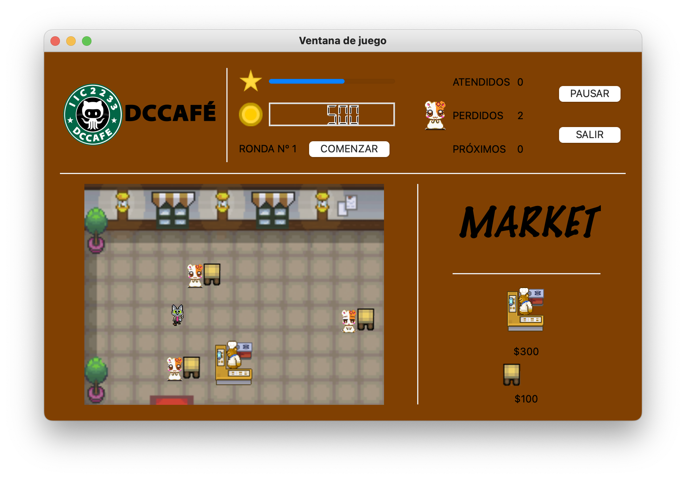

# Coffee Bar Game ☕️

It is a game that simulates the administration and attention of a coffee bar. The player will take the role of the waiter and will eventually be able to make administrative changes to the bar, such as hiring more chefs to speed up the preparation of sandwiches or buying more tables to serve more customers.
The objective of the game is to overcome the greatest number of rounds before the cafeteria is closed due to a bad reputation. Each round will have a specific number of customers that you should serve. At the end of each round you will be able to know the reputation determined by the number of customers you managed to serve and those who left without their coffee.



To run the game:

```
python3 main.py
```

## Considerations

You need to have installed PyQt5 to see the GUI. 
